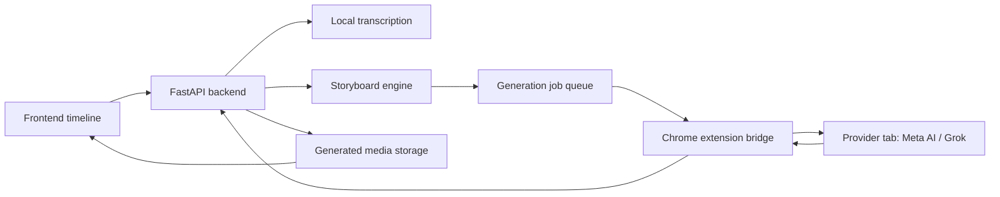

# Auto Video Generation Implementation Plan

## Goal

Build a free, local-first workflow where the user drops an audio file into NeuralScribe, the app transcribes it, creates a timed storyboard from the transcript, generates scene media through the user's logged-in Chrome browser, adds the generated clips to the timeline, and lets the user edit/export the final video.

This plan avoids paid APIs. It uses local transcription, optional local LLMs, and a custom Chrome extension bridge instead of modifying third-party extensions.

## Core Product Flow

1. User imports an audio file.
2. Backend transcribes the audio with local Whisper/faster-whisper.
3. Storyboard engine turns transcript segments into timed scenes.
4. Frontend shows the storyboard for review and edits.
5. User starts generation.
6. Backend creates generation jobs.
7. Our Chrome extension receives jobs from the backend.
8. Extension opens/reuses provider tabs such as Meta AI or Grok.
9. Extension fills prompts, triggers generation, waits for media, and reports results.
10. Backend downloads or stores generated media.
11. Frontend imports generated clips into the timeline at the correct timestamps.
12. User edits, previews, and exports.

## Recommended Architecture



## Why Build Our Own Extension

The existing `auto meta` and `auto grok` extensions are useful references, but they are third-party packaged extensions with minified/bundled code. Connecting to them directly would be brittle.

Our own extension gives us:

- A stable protocol between app and browser.
- Control over permissions and provider adapters.
- A clear status UI.
- Easier debugging.
- No need to modify or depend on third-party extension internals.

## Phase 1 Decisions

- Use the user's existing Chrome installation.
- Build our own Manifest V3 extension.
- Do not modify the third-party `auto meta` or `auto grok` extensions.
- Use `chrome/extensions/neuralscribe-bridge` as our extension folder.
- Build Meta image generation first.
- Add Grok after the bridge and first provider adapter are stable.
- Keep the workflow free/local-first: local transcription, rule-based/local-LLM storyboarding, and browser-based generation.

## Proposed Folder Structure

```text
chrome/extensions/neuralscribe-bridge/
  manifest.json
  background.js
  sidepanel.html
  sidepanel.js
  content/
    meta.js
    grok.js
  shared/
    protocol.js
    provider-config.js

backend/src/domain/models/generation.py
backend/src/domain/services/storyboard_service.py
backend/src/domain/services/generation_queue.py
backend/src/infrastructure/local_llm_service.py
backend/src/infrastructure/browser_bridge.py
backend/src/api/generation.py

frontend/src/components/generation/
  AutoVideoPanel.tsx
  StoryboardEditor.tsx
  GenerationQueuePanel.tsx
```

Note: the current root folder uses `chrome/extentions` for existing third-party extensions. For our code, use the correctly spelled `chrome/extensions/neuralscribe-bridge`.

## Backend Design

### New Data Models

`StoryboardScene`

```json
{
  "id": "scene-001",
  "start": 0.0,
  "end": 5.2,
  "transcript": "The spoken words for this scene.",
  "visualType": "image",
  "prompt": "Cinematic vertical shot of...",
  "negativePrompt": "blurry, low quality, text artifacts",
  "style": "cinematic realistic",
  "camera": "slow push-in",
  "status": "draft"
}
```

`GenerationJob`

```json
{
  "id": "job-001",
  "sceneId": "scene-001",
  "provider": "meta",
  "mediaType": "image",
  "prompt": "Cinematic vertical shot of...",
  "status": "queued",
  "resultUrl": null,
  "localPath": null,
  "error": null
}
```

### Backend Endpoints

- `POST /api/generation/storyboard/from-audio`
  - Input: audio asset id or uploaded file.
  - Output: transcript plus storyboard scenes.

- `POST /api/generation/storyboard/from-transcript`
  - Input: transcript text and optional style settings.
  - Output: storyboard scenes.

- `POST /api/generation/jobs`
  - Creates generation jobs from approved storyboard scenes.

- `GET /api/generation/jobs`
  - Returns queue state.

- `POST /api/generation/jobs/{job_id}/cancel`
  - Cancels a queued/running job.

- `POST /api/generation/jobs/{job_id}/result`
  - Used by the extension to report generated media.

- `GET /api/browser-bridge/status`
  - Shows whether the Chrome extension is connected.

- `WS /api/browser-bridge/ws`
  - WebSocket used by the extension for job receive/status updates.

### Storyboard Engine

The storyboard engine should support three levels:

1. Local LLM mode with Ollama.
2. Local LLM mode with LM Studio or another OpenAI-compatible local server.
3. Optional OpenRouter mode using free models when the user provides their own API key.
4. Optional Google Gemini mode when the user provides their own Gemini API key.
5. Rule-based fallback when no LLM is available.

Rule-based fallback is important. It lets the feature work even on machines that cannot run a good local model and when no API key is configured.

### Optional OpenRouter Setup

OpenRouter support must use environment variables. Do not hardcode API keys in source files.

```bash
cp .env.example .env
```

Then edit `.env`:

```text
NEURALSCRIBE_LLM_MODE=openrouter
NEURALSCRIBE_OPENROUTER_API_KEY=your-rotated-openrouter-key
NEURALSCRIBE_OPENROUTER_MODEL=google/gemma-4-31b-it:free
NEURALSCRIBE_OPENROUTER_REASONING=true
```

If no OpenRouter key is configured, the app falls back to rule-based storyboarding.

### Optional Gemini Setup

Gemini support must use environment variables. Do not hardcode API keys in source files.

```text
NEURALSCRIBE_LLM_MODE=gemini
GEMINI_API_KEY=your-gemini-key
NEURALSCRIBE_GEMINI_MODEL=gemini-3-flash-preview
```

If no Gemini key is configured, the app falls back to rule-based storyboarding.

### Suggested Local LLM Prompt Contract

The LLM must return strict JSON only:

```json
{
  "scenes": [
    {
      "start": 0.0,
      "end": 4.8,
      "transcript": "text from this time range",
      "visualType": "image",
      "prompt": "clear generation prompt",
      "style": "cinematic",
      "camera": "static",
      "negativePrompt": "low quality, artifacts"
    }
  ]
}
```

Backend must validate and repair/clamp the JSON before saving it.

## Chrome Extension Design

### Extension Responsibilities

- Connect to the local backend bridge.
- Display connection status.
- Receive one job at a time or a small controlled batch.
- Open or reuse the provider tab.
- Inject provider-specific content script.
- Submit prompt.
- Wait for media generation.
- Detect generated image/video URL or blob.
- Send result metadata back to backend.
- Report errors and manual-action-needed states.

### Extension Protocol

Extension registers:

```json
{
  "type": "worker.ready",
  "workerId": "chrome-neuralscribe-bridge",
  "version": "0.1.0",
  "providers": ["meta", "grok"]
}
```

Backend sends job:

```json
{
  "type": "job.start",
  "job": {
    "id": "job-001",
    "provider": "meta",
    "mediaType": "image",
    "prompt": "A cinematic..."
  }
}
```

Extension status updates:

```json
{
  "type": "job.status",
  "jobId": "job-001",
  "status": "submitting"
}
```

Extension result:

```json
{
  "type": "job.result",
  "jobId": "job-001",
  "mediaUrl": "https://...",
  "mediaType": "image"
}
```

### Provider Adapters

Start with one provider first.

Meta adapter:

- Target: `https://www.meta.ai/create`
- Detect prompt input.
- Fill prompt.
- Click generate.
- Watch DOM for image/video result.
- Extract media URL.

Grok adapter:

- Target: `https://grok.com/`
- Detect composer.
- Fill prompt.
- Click generate.
- Watch DOM for result cards.
- Extract media URL.

Each provider adapter should return clear statuses:

- `needs_login`
- `ready`
- `submitting`
- `generating`
- `media_found`
- `failed`
- `manual_action_required`

## Frontend Design

Add an `Auto Generate Video` panel:

- Choose source audio clip.
- Select output style.
- Select provider: Meta or Grok.
- Select media type: image scenes first, video scenes later.
- Generate storyboard.
- Review/edit scenes.
- Start generation.
- See per-scene progress.
- Add generated media to timeline.

Timeline behavior:

- Audio remains on an audio track.
- Generated scenes become visual clips on a visual track.
- Clip start and duration match storyboard scene timing.
- Scene prompt is stored with the clip metadata.
- Failed scenes remain as placeholders.

## Storage

Generated media should be stored under a backend runtime folder that is ignored by git:

```text
backend/output/generated/
  job-001.png
  job-002.mp4
```

The backend should expose generated files through an existing or new download/media endpoint.

## Security And Safety

- Only accept bridge connections from localhost.
- Do not expose the bridge to the network.
- Require a simple session token generated by the backend and pasted or fetched by the extension.
- Store only job data and generated media paths, not site passwords or cookies.
- Let the user handle login/captcha manually in Chrome.
- Never bypass provider protections.
- Add clear user-facing messages when manual login or captcha is needed.

## Implementation Phases

### Phase 1: Planning And Data Contracts

Define generation models, storyboard schema, provider status values, and bridge message protocol.

Manual tests:

- Confirm the app still starts.
- Confirm the docs match the workflow we want.

### Phase 2: Storyboard MVP

Add backend storyboard generation from transcript using rule-based logic first. Add local LLM support after the fallback works.

Manual tests:

- Add audio.
- Generate transcript.
- Create storyboard scenes from transcript.
- Edit scene prompts.
- Confirm scene timing covers the audio without major gaps.

### Phase 3: Frontend Storyboard UI

Add a panel where users can generate, review, edit, and approve scenes.

Manual tests:

- Open the Auto Generate Video panel.
- Generate a storyboard from audio.
- Edit a prompt.
- Delete/add a scene.
- Confirm changes stay in state.

### Phase 4: Backend Generation Queue

Add job queue, job statuses, cancel/retry, and local generated-media storage.

Manual tests:

- Create jobs from storyboard scenes.
- See queued/running/completed/failed status.
- Cancel a queued job.
- Retry a failed job.

### Phase 5: Chrome Extension Bridge MVP

Create our own Chrome extension that connects to the backend and shows connected/disconnected status.

Manual tests:

- Load unpacked extension in Chrome.
- Start backend.
- Confirm extension shows connected.
- Stop backend.
- Confirm extension shows disconnected.

### Phase 6: Provider Adapter MVP

Implement one provider first, recommended Meta image generation. Add Grok after the bridge is stable.

Manual tests:

- Log into the provider manually in Chrome.
- Send one test prompt from the app.
- Confirm extension opens provider tab.
- Confirm prompt is inserted.
- Confirm generation starts.
- Confirm result is detected.
- Confirm backend receives the result.

### Phase 7: Timeline Import

Backend saves generated media, frontend imports it, and clips are placed on the timeline using scene timing.

Manual tests:

- Generate 2 to 3 scenes.
- Confirm visual clips appear above the audio.
- Play the timeline.
- Confirm generated visuals align with transcript timing.
- Export the final video.

### Phase 8: Reliability And Batch Controls

Add retries, rate limits, pause/resume, manual-action states, and better provider selectors.

Manual tests:

- Pause a batch.
- Resume a batch.
- Retry one failed scene.
- Handle provider login/manual action.
- Confirm no duplicate clips are created after retry.

## Major Risks

- Provider websites change their DOM and break automation.
- Free services may rate-limit or block too many jobs.
- Local LLMs may produce invalid JSON or weak prompts.
- Generated media URLs may expire before download.
- Chrome extension service workers can sleep, so jobs need resumable state.

## Risk Mitigation

- Keep provider adapters isolated.
- Start with image generation before video generation.
- Save every job status in backend state.
- Validate all LLM JSON.
- Use clear manual-action-needed statuses.
- Make generation optional and editable, not fully automatic with no review.

## Recommended First Build

Start with this minimum useful version:

1. Rule-based storyboard from transcript.
2. Storyboard editor UI.
3. Job queue with fake/mock provider results.
4. Chrome extension connects to backend.
5. One provider adapter for one image prompt.
6. Save result and add it to timeline.

This gives us the full loop without betting everything on provider automation on day one.
